# NBP

## Intro

TODO explain why we are doing this - give general information

## Setting up the working environment

Pyenv is used to manage different Python versions, whereas Pipenv is used to manage Python packages. We will show a complete rundown of how to use them in our project below.

### Pyenv

Install pyenv which is a python version management tool popular in the python community.

```sh
$ pip install pyenv-win
```

Now we need to add pyenv to our environment variables i.e. add two PATH variables:

- %USERPROFILE%\.pyenv\pyenv-win\shims
- %USERPROFILE%\.pyenv\pyenv-win\bin

alternatively we can install pyenv using windows power-shell like so:

```powershell
Invoke-WebRequest -UseBasicParsing -Uri "https://raw.githubusercontent.com/pyenv-win/pyenv-win/master/pyenv-win/install-pyenv-win.ps1" -OutFile "./install-pyenv-win.ps1"; &"./install-pyenv-win.ps1"
```

If Admin permissions aren't granted the following error will arise:

... File C:\Users\kok1\_\install-pyenv-win.ps1 cannot be loaded because running scripts is disabled on this system...

In order to fix this we need to give power-shell Admin privileges so it can successfully run the script:

```powershell
Set-ExecutionPolicy -Scope CurrentUser
```

When prompted for the "ExecutionPolicy", insert "RemoteSigned". Now rerun the first script and it should install pyenv.

Now we can manage/install python version.

### Pipenv

In this project we are using python 3.10, so lets create a virtual environment with that version.
run

```sh
$ pipenv --python 3.10
```

You should get the following message:

- "Successfully created virtual environment!"

To activate this project's virtual environment, run the following:

```sh
$ pipenv shell
```

Now we are in the virtual environment and can start adding necessary dependencies. We can add them using this command:

```sh
$ pipenv install %package_name%
```

the full list of installed packages will be in the "Pipfile" or we can generate a report with

```sh
$ pipenv requirements > requirements.txt
```

## PostgreSQL

TODO explain something about psql

## Neo4j

TODO explain something about neo4j

## Table Structure

Tables look like this:

```sql
CREATE TABLE collections (
    id SERIAL PRIMARY KEY,
    name VARCHAR(255) NOT NULL,
    movie_id INT,
);

CREATE TABLE genres (
    id SERIAL PRIMARY KEY,
    name VARCHAR(255) NOT NULL,
    movie_id INT,
);

CREATE TABLE movies (
    id SERIAL PRIMARY KEY,
    imdb_id VARCHAR(20) NOT NULL,
    title VARCHAR(255) NOT NULL,
    for_adults BOOLEAN,
    collections_id INT,
    budget BIGINT,
    production_companies_id INT,
    production_countries_id INT,
    original_language VARCHAR(10) NOT NULL,
    original_title VARCHAR(255) NOT NULL,
    overview TEXT,
    popularity BIGINT,
    release_date DATE,
    revenue BIGINT,
    runtime FLOAT,
);

CREATE TABLE cast (
    id SERIAL PRIMARY KEY,
    movie_id INT,
    name VARCHAR(255) NOT NULL,
    character VARCHAR(255) NOT NULL,
    gender INT
);

CREATE TABLE crew (
    id SERIAL PRIMARY KEY,
    movie_id INT,
    department VARCHAR(255) NOT NULL,
    job VARCHAR(255) NOT NULL,
    gender VARCHAR(255),
    name VARCHAR(255) NOT NULL
);

CREATE TABLE keywords (
    id SERIAL PRIMARY KEY,
    name VARCHAR(255) NOT NULL
    movie_id INT,
);
```

## How we created the csv files

We created several scripts that create structured csv files from the unstructured data given. The idea was to use DataFrames (df) to manipulate with the unstructured csvs and create structured data which we will later use to create and import values into both our Neo4j and PostgreSQL databases.

Different steps were needed to achieve this.

Creating a structured movies.csv was the easiest. First, we needed to remove these columns from the movies_metadata.csv:
"belongs_to_collection",
"genres",
"video",
"homepage",
"poster_path",
"status",
"vote_average",
"spoken_languages",
"tagline",
"vote_count",
"production_companies", and
"production_countries".

Rename the column "adults" to "for_adults" and save the newly created df as a csv file.

Genres and Collections were taken from movies and iterated through in order to create a list jsons and append the movie_id, then create a df and lastly save the data into a csv.

The most difficult task was to create cast, crew and keywords. This data was structured in a way such that we would need to iterate through a list of json objects (which were in fact strings) and create a list of lists of jsons. This was later flattened and decoded to pure json and finally cast to df and saved as csvs as well.

## Importing data in PostgreSQL through csv files

...

## Importing data in Neo4j through csv files

Firstly, we need to add the csv files in the working import directory of neo4j.
After locating the dir: 'C:\Users\kok1\_\.Neo4jDesktop\relate-data\dbmss\dbms-2a3a6e7e-b292-4907-a6a0-e5426c5449fc', we need to add all the csv files in the '/import' folder.

After doing this we can run this query which creates nodes and fills them with the data we provide through the aforementioned csvs:

```cql
LOAD CSV WITH HEADERS FROM 'file:///collections.csv' AS row
CREATE (:Collection {
   id: toInteger(row.id),
   name: row.name,
   poster_path: row.poster_path,
   backdrop_path: row.backdrop_path,
   movie_id: toInteger(row.movie_id)
});
```

Above example is for collections.cql, but similar queries can be easily constructed for all the other nodes.

These files were not imported by hand, instead we used a script, i.e. create_neo4j_db.py. While running the script we encountered a memory error:

```
Error during execution: {code: Neo.TransientError.General.MemoryPoolOutOfMemoryError} {message: The allocation of an extra 2.0 MiB would use more than the limit 716.8 MiB. Currently using 715.0 MiB. dbms.memory.transaction.total.max threshold reached}
```

So we needed to set the transaction the limit to: dbms.memory.transaction.total.max=1000m, in the neo4j.conf file.

After doing this we can check how many nodes were imported with:

```cql
MATCH (n)
RETURN count(n) AS nodeCount;
```

we can see that we have imported 375431 nodes and if we want to see how relations between them look like:

```cql
MATCH (node1)--(node2)
RETURN node1, node2
LIMIT 1000;
```

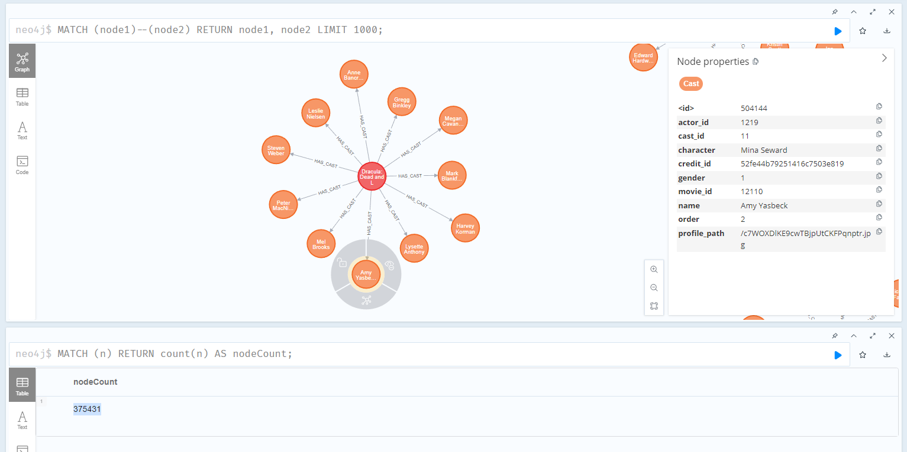

## Analyzing Queries

### Select Queries

1. Select all movies where budget is larger than 60000000:

CQL:

```cql
MATCH (m:Movie)
WHERE m.budget > 60000000
RETURN m;
```

> 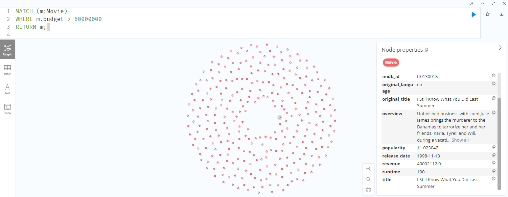
> Started streaming 820 records after 8 ms and completed after 1135 ms.

PSQL:

```sql
SELECT *
FROM movies
WHERE budget > 60000000;
```

2. Select all cast members whose name is Robin Williams:

CQL:

```cql
MATCH (c:Cast)
WHERE c.name = 'Robin Williams'
RETURN c;
```

> 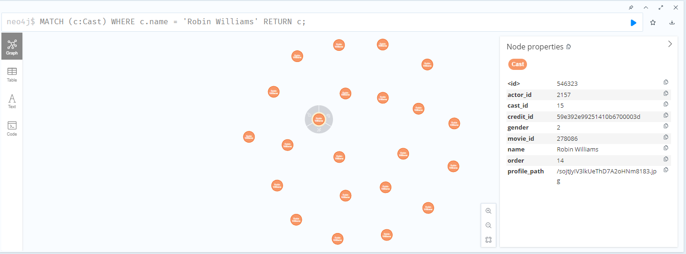
> Started streaming 22 records after 60 ms and completed after 926 ms.

PSQL:

```sql
SELECT *
FROM cast
WHERE name = 'Robin Williams';
```

3. Select all crew whose job is Director:

CQL:

```cql
MATCH (crew:Crew)
WHERE crew.job = 'Director'
RETURN crew;
```

> 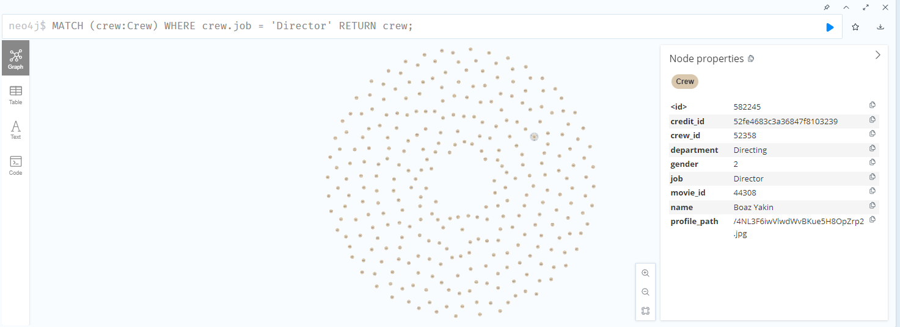
> Started streaming 4675 records after 7 ms and completed after 240 ms, displaying first 1000 rows.

PSQL:

```sql
SELECT *
FROM crew
WHERE job = 'Director';
```

4. Select all genres that are Comedy:

CQL:

```cql
MATCH (g:Genre)
WHERE g.name = 'Comedy'
RETURN g;
```

> 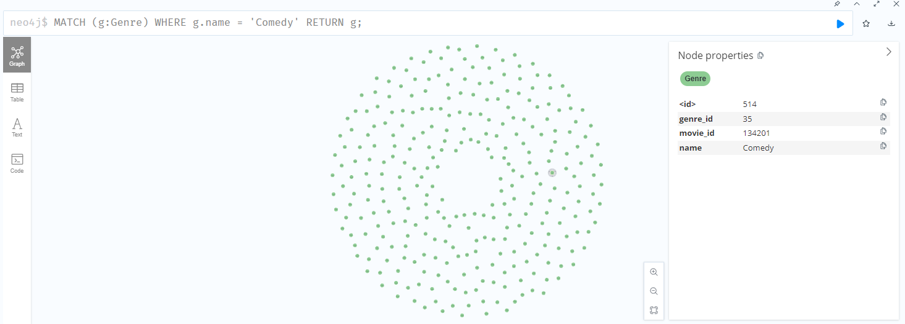
> Started streaming 13182 records after 6 ms and completed after 355 ms, displaying first 1000 rows.

PSQL:

```sql
SELECT *
FROM genres
WHERE name = 'Comedy';
```

### Join Queries

1. Select movie nodes and all of their relations

```cql
MATCH (node1)--(node2)
RETURN node1, node2
LIMIT 1000;
```

```sql
SELECT *
FROM movies AS m
JOIN movies_keywords AS mk ON m.movie_id = mk.movie_id
JOIN movies_genres AS mg ON m.movie_id = mg.movie_id
JOIN movies_crew AS mc ON m.movie_id = mc.movie_id
JOIN movies_collections AS mcol ON m.movie_id = mcol.movie_id
JOIN movies_cast AS mcast ON m.movie_id = mcast.movie_id
LIMIT 1000;
```

1. Select all movies with cast and crew where Robin Williams is in the cast:

CQL:

```cql
MATCH (m:Movie)-[:HAS_CAST]->(c:Cast)
MATCH (m)-[:HAS_CREW]->(cr:Crew)
WHERE c.name = 'Robin Williams'
RETURN m, c, cr;
```

> 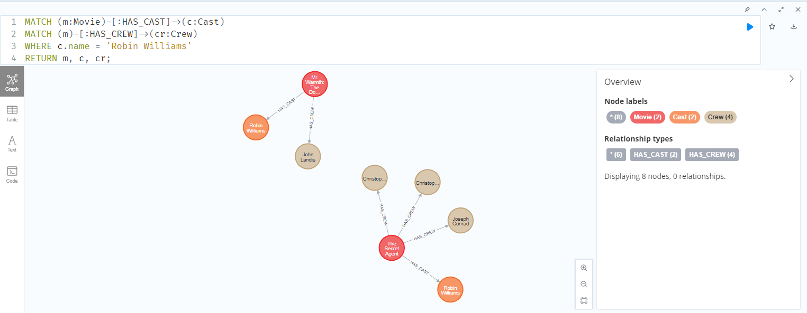
> Started streaming 4 records after 15 ms and completed after 336 ms.

PSQL:

```sql
SELECT m., c., cr.*
FROM movies m
JOIN cast c ON m.id = c.movie_id
JOIN crew cr ON m.id = cr.movie_id
WHERE c.name = 'Robin Williams';
```

2. Select all movies with genre Comedy and Robin Williams is in the cast:

CQL:

```cql
MATCH (m:Movie),
      (m)-[:HAS_CAST]->(c:Cast {name: 'Robin Williams'}),
      (m)-[:BELONGS_TO]->(g:Genre {name: 'Comedy'})
RETURN m,c,g;
```

> 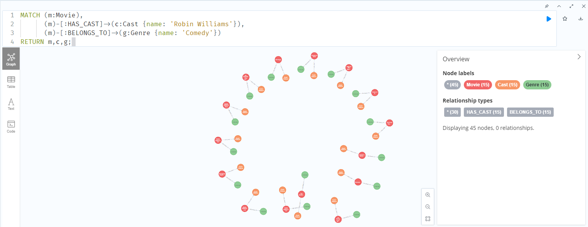
> Started streaming 15 records after 33 ms and completed after 97 ms.

PSQL:

```sql
SELECT m.*, c.*, g.*
FROM movies m
JOIN cast c ON m.id = c.movie_id
JOIN genres g ON m.id = g.movie_id
WHERE c.name = 'Robin Williams' AND g.name = 'Comedy';
```

3. Select all movies with their cast, genre, crew, and keywords, where the genre is Drama:

CQL:

```cql
MATCH (m:Movie)-[:HAS_CAST]->(c:Cast),
      (m)-[:BELONGS_TO]->(g:Genre {name: 'Drama'}),
      (m)-[:HAS_CREW]->(crew:Crew),
      (m)-[:HAS_KEYWORD]->(keyword:Keyword)
RETURN m, c, g, crew, keyword;
```

> 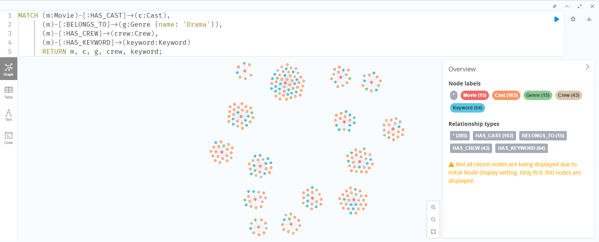
> Started streaming 23635 records after 24 ms and completed after 898 ms, displaying first 1000 rows.

PSQL:

```sql
SELECT movies.*, cast.*, genres.*, crew.*, keywords.*
FROM movies
JOIN cast ON movies.id = cast.movie_id
JOIN genres ON movies.id = genres.movie_id AND genres.name = 'Drama'
JOIN crew ON movies.id = crew.movie_id
JOIN keywords ON movies.id = keywords.movie_id;
```

### Aggregation Queries

1. Most Common Keywords in Movies

CQL:

```cql
MATCH (k:Keyword)<-[:HAS_KEYWORD]-(m:Movie)
RETURN k.name, COUNT(m) AS movieCount
ORDER BY movieCount DESC
LIMIT 5;
```

> 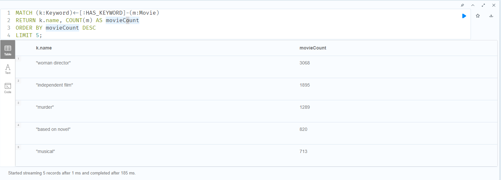
> Started streaming 5 records after 1 ms and completed after 185 ms.

PSQL:

```sql
SELECT k.name AS keyword_name, COUNT(mk.movie_id) AS movieCount
FROM keywords k
JOIN movies_keywords mk ON k.name = mk.keyword_name
GROUP BY k.name
ORDER BY movieCount DESC
LIMIT 5;
```

2. Movies with the Highest Revenue in Each Genre

CQL:

```cql
MATCH (g:Genre)<-[:BELONGS_TO]-(m:Movie)
WITH g, m
ORDER BY g.name, m.revenue DESC
WITH g, COLLECT(m)[0] AS topMovie
RETURN g.name, topMovie.title, topMovie.revenue
ORDER BY g.name;
```

> 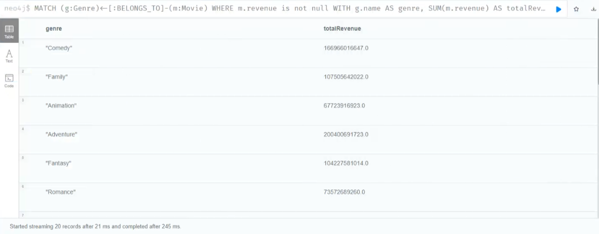
> Started streaming 91094 records after 17 ms and completed after 1846 ms, displaying first 1000 rows.

PSQL:

```sql
WITH RankedMovies AS (
  SELECT
    g.name AS genre_name,
    m.title,
    m.revenue,
    ROW_NUMBER() OVER (PARTITION BY g.name ORDER BY m.revenue DESC) AS rnk
  FROM genres g
  JOIN movies_genres mg ON g.genre_id = mg.genre_id
  JOIN movies m ON mg.movie_id = m.movie_id
)
SELECT genre_name, title, revenue
FROM RankedMovies
WHERE rnk = 1
ORDER BY genre_name;
```

3. Average Runtime of Movies Released Each Year:

CQL:

```cql
MATCH (m:Movie)
WITH m, SUBSTRING(m.release_date, 0, 4) AS releaseYear
RETURN releaseYear, AVG(m.runtime) AS averageRuntime
ORDER BY releaseYear;
```

> 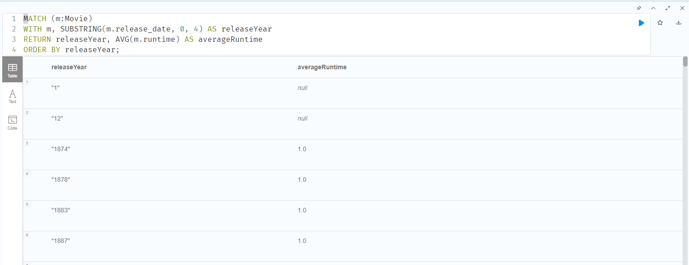
> Started streaming 139 records after 11 ms and completed after 190 ms.

PSQL:

```sql
SELECT
  SUBSTRING(m.release_date FROM 1 FOR 4) AS releaseYear,
  AVG(m.runtime) AS averageRuntime
FROM movies m
WHERE m.release_date IS NOT NULL
GROUP BY releaseYear
ORDER BY releaseYear;
```

4. Number of Movies and Total Revenue for Each Cast Member in Comedy Genre:

CQL:

```cql
MATCH (c:Cast)-[:HAS_CAST]->(m:Movie)-[:BELONGS_TO]->(g:Genre {name: 'Comedy'})
RETURN c.name, COUNT(m) AS movieCount, SUM(m.revenue) AS totalRevenue
ORDER BY totalRevenue DESC, movieCount DESC;
```

> 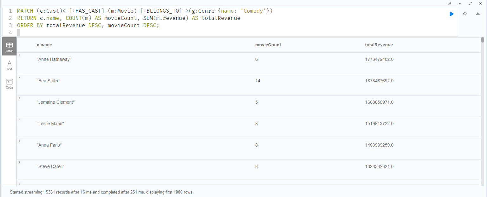
> Started streaming 15331 records after 16 ms and completed after 251 ms, displaying first 1000 rows.

PSQL:

```sql
SELECT
  c.name AS cast_name,
  COUNT(m.movie_id) AS movieCount,
  SUM(m.revenue) AS totalRevenue
FROM cast c
JOIN movies_cast mc ON c.cast_id = mc.cast_id
JOIN movies m ON mc.movie_id = m.movie_id
JOIN movies_genres mg ON m.movie_id = mg.movie_id
JOIN genres g ON mg.genre_id = g.genre_id
WHERE g.name = 'Comedy'
GROUP BY c.name
ORDER BY totalRevenue DESC, movieCount DESC;
```

## Note:

Something like the following is not possible in SQL:

```cql
MATCH (node1)--(node2)
RETURN node1, node2
LIMIT 1000;
```

This Cypher query is generic. It does not specify a particular relationship type or direction and retrieves pairs of nodes connected by any type of relationship in the graph. The nodes and relationships in a graph are not inherently organized into tables and rows, so the result structure is different.

On the other hand, in order to achieve a similar effect we would need to query and join all of the tables or join only a couple of predetermined tables and only then limit the elements returned.

```sql
SELECT *
FROM movies AS m
JOIN keywords AS mk ON m.id = mk.movie_id
JOIN genres AS mg ON m.id = mg.movie_id
JOIN crew AS mc ON m.id = mc.movie_id
JOIN collections AS mcol ON m.id = mcol.movie_id
JOIN cast AS mcast ON m.id = mcast.movie_id
LIMIT 1000;
```

or

```sql
SELECT *
FROM movies AS m
JOIN movies_keywords AS mk ON m.id = mk.movie_id
LIMIT 1000;
```

## Conclusion:
