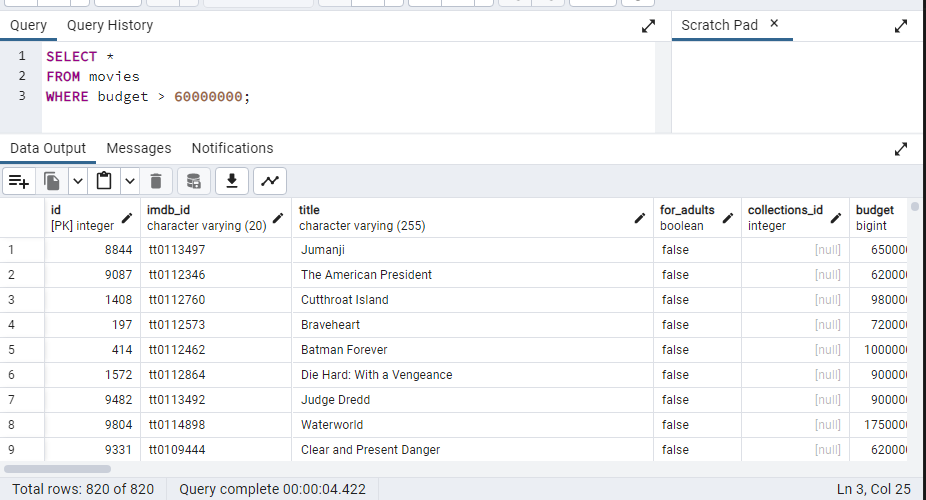

# NBP

## Intro

TODO explain why we are doing this - give general information

## Setting up the working environment

Pyenv is used to manage different Python versions, whereas Pipenv is used to manage Python packages. We will show a complete rundown of how to use them in our project below.

### Pyenv

Install pyenv which is a python version management tool popular in the python community.

```sh
$ pip install pyenv-win
```

Now we need to add pyenv to our environment variables i.e. add two PATH variables:

- %USERPROFILE%\.pyenv\pyenv-win\shims
- %USERPROFILE%\.pyenv\pyenv-win\bin

alternatively we can install pyenv using windows power-shell like so:

```powershell
Invoke-WebRequest -UseBasicParsing -Uri "https://raw.githubusercontent.com/pyenv-win/pyenv-win/master/pyenv-win/install-pyenv-win.ps1" -OutFile "./install-pyenv-win.ps1"; &"./install-pyenv-win.ps1"
```

If Admin permissions aren't granted the following error will arise:

... File C:\Users\kok1\_\install-pyenv-win.ps1 cannot be loaded because running scripts is disabled on this system...

In order to fix this we need to give power-shell Admin privileges so it can successfully run the script:

```powershell
Set-ExecutionPolicy -Scope CurrentUser
```

When prompted for the "ExecutionPolicy", insert "RemoteSigned". Now rerun the first script and it should install pyenv.

Now we can manage/install python version.

### Pipenv

In this project we are using python 3.10, so lets create a virtual environment with that version.
run

```sh
$ pipenv --python 3.10
```

You should get the following message:

- "Successfully created virtual environment!"

To activate this project's virtual environment, run the following:

```sh
$ pipenv shell
```

Now we are in the virtual environment and can start adding necessary dependencies. We can add them using this command:

```sh
$ pipenv install %package_name%
```

the full list of installed packages will be in the "Pipfile" or we can generate a report with

```sh
$ pipenv requirements > requirements.txt
```

## PostgreSQL

TODO explain something about psql

## Neo4j

TODO explain something about neo4j

## Table Structure

Tables look like this:

```sql
CREATE TABLE collections (
    pkey SERIAL PRIMARY KEY,
	id INT,
    name VARCHAR(255) NOT NULL,
	poster_path VARCHAR(255),
	backdrop_path VARCHAR(255),
    movie_id INT
);

CREATE TABLE genres (
    pkey SERIAL PRIMARY KEY,
	id INT,
    name VARCHAR(255) NOT NULL,
    movie_id INT
);

CREATE TABLE movies (
    id SERIAL PRIMARY KEY,
    imdb_id VARCHAR(20) ,
    title VARCHAR(255) ,
    for_adults BOOLEAN,
    collections_id INT,
    budget BIGINT,
    original_language VARCHAR(10) ,
    original_title VARCHAR(255) ,
    overview TEXT,
    popularity FLOAT,
    release_date DATE,
    revenue FLOAT,
    runtime FLOAT
);

CREATE TABLE "cast" (
	pkey SERIAL PRIMARY KEY,
    id INT,
	profile_path VARCHAR(255),
	credit_id VARCHAR(255),
	cast_id VARCHAR(255),
    movie_id INT,
    name VARCHAR(255) NOT NULL,
    character VARCHAR(512),
    gender INT
);


CREATE TABLE crew (
    pkey SERIAL PRIMARY KEY,
	id INT,
    movie_id INT,
	credit_id VARCHAR(255),
    department VARCHAR(255),
    job VARCHAR(255),
    gender VARCHAR(255),
	profile_path VARCHAR(255),
    name VARCHAR(255)
);

CREATE TABLE keywords (
	pkey SERIAL PRIMARY KEY,
    id INT,
    name VARCHAR(255),
    movie_id INT
);
```

## How we created the csv files

We created several scripts that create structured csv files from the unstructured data given. The idea was to use DataFrames (df) to manipulate with the unstructured csvs and create structured data which we will later use to create and import values into both our Neo4j and PostgreSQL databases.

Different steps were needed to achieve this.

Creating a structured movies.csv was the easiest. First, we needed to remove these columns from the movies_metadata.csv:
"belongs_to_collection",
"genres",
"video",
"homepage",
"poster_path",
"status",
"vote_average",
"spoken_languages",
"tagline",
"vote_count",
"production_companies", and
"production_countries".

Rename the column "adults" to "for_adults" and save the newly created df as a csv file.

Genres and Collections were taken from movies and iterated through in order to create a list jsons and append the movie_id, then create a df and lastly save the data into a csv.

The most difficult task was to create cast, crew and keywords. This data was structured in a way such that we would need to iterate through a list of json objects (which were in fact strings) and create a list of lists of jsons. This was later flattened and decoded to pure json and finally cast to df and saved as csvs as well.

## Importing data in PostgreSQL through csv files

We first needed to create tables by running the create_pg_tables.sql script (the contents of which can be seen above in the table structure).
Next, running the python script create_pg_db.py populates the tables with values taken from the csvs we previously created (seen in the csvs folder).

In this script we can see that after connecting to the local postgresql databse we create dataframes which we use to manipulate the columns of the csvs and drop unnecessary data. After this we simply specify the df and the table which needs to be populated like so:

```py
df.to_sql(table_name, engine, if_exists="append", index=False)
```

## Importing data in Neo4j through csv files

Firstly, we need to add the csv files in the working import directory of neo4j.
After locating the dir: 'C:\Users\kok1\_\.Neo4jDesktop\relate-data\dbmss\dbms-2a3a6e7e-b292-4907-a6a0-e5426c5449fc', we need to add all the csv files in the '/import' folder.

After doing this we can run this query which creates nodes and fills them with the data we provide through the aforementioned csvs:

```cql
LOAD CSV WITH HEADERS FROM 'file:///collections.csv' AS row
CREATE (:Collection {
   id: toInteger(row.id),
   name: row.name,
   poster_path: row.poster_path,
   backdrop_path: row.backdrop_path,
   movie_id: toInteger(row.movie_id)
});
```

Above example is for collections.cql, but similar queries can be easily constructed for all the other nodes.

These files were not imported by hand, instead we used a script, i.e. create_neo4j_db.py. While running the script we encountered a memory error:

```
Error during execution: {code: Neo.TransientError.General.MemoryPoolOutOfMemoryError} {message: The allocation of an extra 2.0 MiB would use more than the limit 716.8 MiB. Currently using 715.0 MiB. dbms.memory.transaction.total.max threshold reached}
```

So we needed to set the transaction the limit to: dbms.memory.transaction.total.max=1000m, in the neo4j.conf file.

After doing this we can check how many nodes were imported with:

```cql
MATCH (n)
RETURN count(n) AS nodeCount;
```

we can see that we have imported 375431 nodes and if we want to see how relations between them look like:

```cql
MATCH (node1)--(node2)
RETURN node1, node2
LIMIT 1000;
```


## Analyzing Queries

### Select Queries

1. Select all movies where budget is larger than 60000000:

CQL:

```cql
MATCH (m:Movie)
WHERE m.budget > 60000000
RETURN m;
```

> 
> Started streaming 820 records after 8 ms and completed after 1135 ms.

PSQL:

```sql
SELECT *
FROM movies
WHERE budget > 60000000;
```

> 
> Total rows: 820 of 820; Query complete 00:00:04.422

2. Select all cast members whose name is Robin Williams:

CQL:

```cql
MATCH (c:Cast)
WHERE c.name = 'Robin Williams'
RETURN c;
```

> 
> Started streaming 22 records after 60 ms and completed after 926 ms.

PSQL:

```sql
SELECT *
FROM cast
WHERE name = 'Robin Williams';
```

> 
> Total rows: 88 of 88; Query complete 00:00:00.251

3. Select all crew whose job is Director:

CQL:

```cql
MATCH (crew:Crew)
WHERE crew.job = 'Director'
RETURN crew;
```

> 
> Started streaming 4675 records after 7 ms and completed after 240 ms, displaying first 1000 rows.

PSQL:

```sql
SELECT *
FROM crew
WHERE job = 'Director';
```

> 
> Total rows: 1000 of 18700; Query complete 00:00:00.397

4. Select all genres that are Comedy:

CQL:

```cql
MATCH (g:Genre)
WHERE g.name = 'Comedy'
RETURN g;
```

> 
> Started streaming 13182 records after 6 ms and completed after 355 ms, displaying first 1000 rows.

PSQL:

```sql
SELECT *
FROM genres
WHERE name = 'Comedy';
```

> 
> Total rows: 1000 of 52728; Query complete 00:00:00.248

### Join Queries

1. Select all movies with cast and crew where Robin Williams is in the cast:

CQL:

```cql
MATCH (m:Movie)-[:HAS_CAST]->(c:Cast)
MATCH (m)-[:HAS_CREW]->(cr:Crew)
WHERE c.name = 'Robin Williams'
RETURN m, c, cr;
```

> 
> Started streaming 4 records after 15 ms and completed after 336 ms.

PSQL:

```sql
SELECT *
FROM movies m
LEFT JOIN "cast" ca ON m.id = ca.movie_id
LEFT JOIN crew ON m.id = crew.movie_id
WHERE ca.name = 'Robin Williams';
```

> 
> Total rows: 144 of 144; Query complete 00:00:00.257

2. Select all movies with genre Comedy and Robin Williams is in the cast:

CQL:

```cql
MATCH (m:Movie),
      (m)-[:HAS_CAST]->(c:Cast {name: 'Robin Williams'}),
      (m)-[:BELONGS_TO]->(g:Genre {name: 'Comedy'})
RETURN m,c,g;
```

> 
> Started streaming 15 records after 33 ms and completed after 97 ms.

PSQL:

```sql
SELECT *
FROM movies m
LEFT JOIN genres g ON m.id = g.movie_id
LEFT JOIN "cast" ca ON m.id = ca.movie_id
WHERE g.name = 'Comedy' AND ca.name = 'Robin Williams';
```

> 
> Total rows: 240 of 240; Query complete 00:00:00.180

3. Select all movies with their cast, genre, crew, and keywords, where the genre is Drama:

CQL:

```cql
MATCH (m:Movie)-[:HAS_CAST]->(c:Cast),
      (m)-[:BELONGS_TO]->(g:Genre {name: 'Drama'}),
      (m)-[:HAS_CREW]->(crew:Crew),
      (m)-[:HAS_KEYWORD]->(keyword:Keyword)
RETURN m, c, g, crew, keyword;
```

> 
> Started streaming 23635 records after 24 ms and completed after 898 ms, displaying first 1000 rows.

PSQL:

```sql
SELECT
    m.title AS movie_title,
    c.name AS cast_name,
    c.character,
    g.name AS genre,
    cr.name AS crew_name,
    k.name AS keyword
FROM movies m
JOIN genres g ON m.id = g.movie_id
JOIN "cast" c ON m.id = CAST(c.movie_id AS INT)
JOIN crew cr ON m.id = cr.movie_id
JOIN keywords k ON m.id = k.movie_id
WHERE g.name = 'Drama';

```

> 
Total rows: 1000 of 23635
Query complete 00:00:00.237

### Aggregation Queries

1. Most Common Keywords in Movies

CQL:

```cql
MATCH (k:Keyword)<-[:HAS_KEYWORD]-(m:Movie)
RETURN k.name, COUNT(m) AS movieCount
ORDER BY movieCount DESC
LIMIT 5;
```

> 
> Started streaming 5 records after 1 ms and completed after 185 ms.

PSQL:

```sql
SELECT k.name AS keyword, COUNT(*) AS keyword_count
FROM keywords k
GROUP BY k.name
ORDER BY keyword_count DESC
LIMIT 5;
```

> 
> Total rows: 5 of 5; Query complete 00:00:00.680

2. Movies with the Highest Revenue in Each Genre

CQL:

```cql
MATCH (g:Genre)<-[:BELONGS_TO]-(m:Movie)
WHERE m.revenue is not null
WITH g.name AS genre, SUM(m.revenue) AS totalRevenue
RETURN genre, totalRevenue;
```

> 
> Started streaming 20 records after 21 ms and completed after 245 ms.

PSQL:

```sql
WITH RankedMovies AS (
    SELECT m.id AS movie_id, g.name AS genre,
        m.title AS movie_title, m.revenue,
        ROW_NUMBER() OVER
			(PARTITION BY g.name ORDER BY m.revenue DESC) AS ranking
    FROM movies m
    JOIN genres g ON m.id = g.movie_id
    WHERE m.revenue IS NOT NULL
)
SELECT movie_id, genre, movie_title, revenue
FROM RankedMovies
WHERE ranking = 1;
```

> 
> Total rows: 20 of 20; Query complete 00:00:00.935

3. Average Runtime of Movies Released Each Year:

CQL:

```cql
MATCH (m:Movie)
WITH m, SUBSTRING(m.release_date, 0, 4) AS releaseYear
RETURN releaseYear, AVG(m.runtime) AS averageRuntime
ORDER BY releaseYear;
```

> 
> Started streaming 139 records after 11 ms and completed after 190 ms.

PSQL:

```sql
SELECT EXTRACT(YEAR FROM release_date) AS release_year,
       AVG(runtime) AS average_runtime
FROM movies
WHERE release_date IS NOT NULL AND runtime IS NOT NULL
GROUP BY release_year
ORDER BY release_year;
```

> 
> Total rows: 135 of 135; Query complete 00:00:03.657

4. Number of Movies and Total Revenue for Each Cast Member in Comedy Genre:

CQL:

```cql
MATCH (c:Cast)-[:HAS_CAST]->(m:Movie)-[:BELONGS_TO]->(g:Genre {name: 'Comedy'})
RETURN c.name, COUNT(m) AS movieCount, SUM(m.revenue) AS totalRevenue
ORDER BY totalRevenue DESC, movieCount DESC;
```

> 
> Started streaming 15331 records after 16 ms and completed after 251 ms, displaying first 1000 rows.

PSQL:

```sql
SELECT c.name AS cast_member,
       COUNT(DISTINCT m.id) AS number_of_movies,
       SUM(m.revenue) AS total_revenue
FROM "cast" c
JOIN movies m ON c.movie_id = m.id
JOIN genres g ON m.id = g.movie_id
WHERE g.name = 'Comedy'
GROUP BY c.name
ORDER BY total_revenue DESC;
```

> 
> Total rows: 1000 of 15331; Query complete 00:00:08.770

## Note:

Something like the following is not possible in SQL:

```cql
MATCH (node1)--(node2)
RETURN node1, node2
LIMIT 1000;
```

This Cypher query is generic. It does not specify a particular relationship type or direction and retrieves pairs of nodes connected by any type of relationship in the graph. The nodes and relationships in a graph are not inherently organized into tables and rows, so the result structure is different.

On the other hand, in order to achieve a similar effect we would need to query and join all of the tables or join only a couple of predetermined tables and only then limit the elements returned.

```sql
SELECT *
FROM movies AS m
JOIN keywords AS mk ON m.id = mk.movie_id
JOIN genres AS mg ON m.id = mg.movie_id
JOIN crew AS mc ON m.id = mc.movie_id
JOIN collections AS mcol ON m.id = mcol.movie_id
JOIN "cast" AS c ON m.id = c.movie_id
LIMIT 1000;
```

or

```sql
SELECT *
FROM movies AS m
JOIN keywords AS k ON m.id = k.movie_id
LIMIT 1000;
```

## Conclusion:

TODO

## Additional work:

Create a docker-compose file :)
